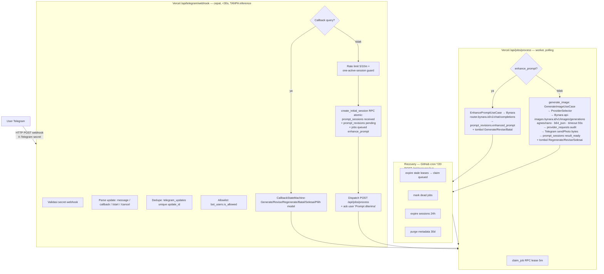

# Arsitektur & Alur Prompt → Generate

Dokumen ini menjelaskan alur proses dari prompt user sampai gambar terkirim, beserta
platform dan tech stack yang terlibat. Berlaku untuk production
(`@albot_ai_bot`, `albot-be.alamaby.com`) dengan Supabase dev `ceqcitzbosqzxpbtlpfn`
sebagai staging migration-only (bot dev dihapus, lihat
`plans/2026-09-02-bot-dev-removal-and-auto-prod-plan.md`).

## 1. Platform & Tech Stack

| Lapisan       | Teknologi                                                                     | Peran                                  |
| ------------- | ----------------------------------------------------------------------------- | -------------------------------------- |
| **Client**    | Telegram (`@albot_ai_bot` — production only)                                  | User kirim prompt / klik tombol        |
| **Edge API**  | Next.js 16 App Router, Node.js runtime di **Vercel**                          | Webhook + endpoint internal            |
| **Domain**    | TypeScript `src/server/application/`                                          | Use case, state machine, guards        |
| **DB**        | **Supabase Postgres** (hosted)                                                | Durable job store + state              |
| **Auth DB**   | `SUPABASE_SECRET_KEY` (`sb_secret_...`)                                       | Service-role bypass RLS, satu client   |
| **Reasoning** | Bynara `router.bynara.id/v1` (laguna-s-2.1, nemotron-3-ultra)                 | Enhance prompt                         |
| **Image**     | Bynara `api-images.bynara.id/v1` (agnes-2.0/2.1, nano-banana-pro) + Pixazo    | Generate gambar (b64_json)             |
| **Scheduler** | GitHub Actions cron `*/20` (production `recovery-production.yml`)             | Recovery sweep prod                    |
| **CI/CD**     | GitHub Actions `validate` → `migrate-production` (auto) → `deploy-production` | Auto on push main (schema before code) |

- **Satu Supabase project per environment**: dev `ceqcitzbosqzxpbtlpfn`, prod
  `pcexxtckvwmiquseznaz`. RLS FORCE, service_role only.
- **Tanpa Supabase Storage**: gambar dikirim langsung sebagai bytes (`b64_json`)
  via Telegram `sendPhoto`; URL tidak disimpan. Regenerasi = biaya baru (by design).

## 2. Diagram Alur

## 3. Detail Perfase

### 3.1 Webhook (event-driven, sinkron cepat)

1. Telegram POST ke `/api/telegram/webhook` dengan header
   `X-Telegram-Bot-Api-Secret-Token` (`TELEGRAM_WEBHOOK_SECRET`).
2. Parse payload menjadi `ParsedUpdate` (message / callback_query / perintah).
3. **Dedupe** via `telegram_updates` (insert sekali; partial unique pada `update_id`).
4. **Auth** via `bot_users` (allowlist / admin).
5. **Callback** (`callback_query`) → `CallbackStateMachine`
   (`src/server/application/callback-state-machine.ts`). Untuk `generate` /
   `regenerate`: muat `user_image_preferences` + `provider_configs` + validasi
   key eligible, lalu insert `generate_image` job + dispatch.
6. **Teks biasa** → guard rate limit + one-active-session → RPC
   `create_initial_session` atomically membuat `prompt_sessions` + `prompt_revisions`
   - `jobs` (`enhance_prompt`, `queued`).
   * Migrasi `20260828120000` memastikan sesi stale yang `expires_at`-nya lewat
     di-expire di dalam RPC sebelum insert, agar partial unique
     `prompt_sessions_one_active_idx` tidak menolak prompt baru.
7. **Dispatch** ke `/api/jobs/process` lalu balas ack. Webhook selesai `< 30s`
   (tidak menjalankan inference — hanya persist + dispatch).

### 3.2 Job Processor (worker, polling)

- Memakai `/api/jobs/process`, dipanggil oleh **dispatcher webhook** + **recovery
  sweep (cron 20 menit)** + manual.
- `claim_job` RPC mengunci job dgn lease (`processing`, `lease_expires_at`).
- Dua pipeline:
  - **enhance_prompt** → `EnhancePromptUseCase` → reasoning provider (Bynara) →
    simpan `enhanced_prompt`.
  - **generate_image** → `GenerateImageUseCase` → image provider (Bynara/Pixazo) →
    `sendPhoto` → `result_ready`.

### 3.3 Provider Selection

- `ProviderSelector` membungkus `provider_configs` + `provider_keys` dari DB env
  yang bersangkutan. Urutan config dikendalikan oleh kolom `selection_strategy`
  per-config (`priority_failover` / `weighted` / `round_robin`): config dijalan
  berurutan by priority dan dikelompokkan per strategy kontigu — grup
  `round_robin` diputar per-seed (mis. 5 model free OpenRouter, priority 200–230),
  `weighted` di-draw dalam grupnya, `priority_failover` urut priority. Config
  pertama dengan key eligible menang; grup tanpa key eligible tidak memblokir
  grup di belakangnya.
- Key didekripsi on-demand dengan `PROVIDER_KEY_ENCRYPTION_KEY` (AES-GCM);
  ciphertext disimpan di `provider_keys`. Cooldown/retry otomatis.

### 3.4 Recovery & Resilience

- **Lease recovery**: worker crash → job `processing` dgn lease expired → sweep
  mengembalikan ke `queued` (attempt+1) → retry.
- **Session expiry** 24 jam otomatis; **retention purge** 30 hari.
- **Idempotency**: partial unique index `prompt_sessions_one_active_idx`.

### 3.5 Deploy & Migration Pipeline (auto push main)

1. `validate.yml` — lint / typecheck / test / build.
2. `migrate-production.yml` (auto `push`) — `supabase db push` ke prod `pcexxtckvwmiquseznaz` (standalone, `EXPECTED_REF` check — Opsi C). Dev workflow dihapus 2026-09-05.
3. `deploy-production.yml` (auto `workflow_run` setelah `migrate-production` success) — `vercel build` + `vercel deploy --prod` ke `albot-be.alamaby.com`. Vercel Git Integration dimatikan agar urutan `schema before code` terjamin (T7a).
4. Workflow recovery `*/20` hanya prod (`recovery-production.yml`); dev recovery dihapus bersama bot dev.

## 4. Catatan / Trade-off

- **Asinkron**: webhook + dispatcher memisahkan inference; webhook tetap cepat,
  worker jalan pada panggilan job berikutnya.
- **Tanpa Storage**: gambar via `sendPhoto` bytes, URL tidak disimpan → regenerasi
  menimbulkan biaya baru (disorot di `docs/runbooks/production-handoff.md`).
- **Satu client service-role**: seluruh repositori memakai `getSupabaseAdmin()`
  singleton — simpel tapi bypass RLS penuh (acceptable untuk single-server bot).
  Migrasi ke Supabase Secret Keys (`sb_secret_...`) adalah upgrade format/lifecycle,
  bukan perubahan model otorisasi.
- **Self-dispatch (webhook → `/api/jobs/process`)**: webhook memicu processor
  miliknya sendiri via HTTP POST best-effort (timeout 5s) alih-alih queue
  eksternal. Trade-off yang diterima: (a) sederhana tanpa infrastruktur tambahan;
  (b) mengonsumsi konkurensi function Vercel (panggilan origin ke diri sendiri);
  (c) bergantung pada URL origin deployment yang benar; (d) kegagalan dispatch
  terlihat user ("Gagal memulai pemrosesan. Silakan coba lagi sebentar.") —
  namun job durable tetap tersimpan dan di-claim recovery cron */20, sehingga
  tidak ada job yang hilang. Alternatif (pg_cron / queue eksternal) ditolak
  agar tetap dalam batas Vercel Hobby.
