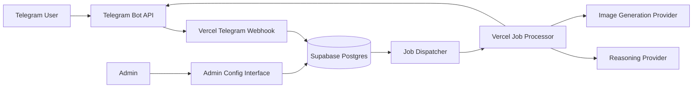
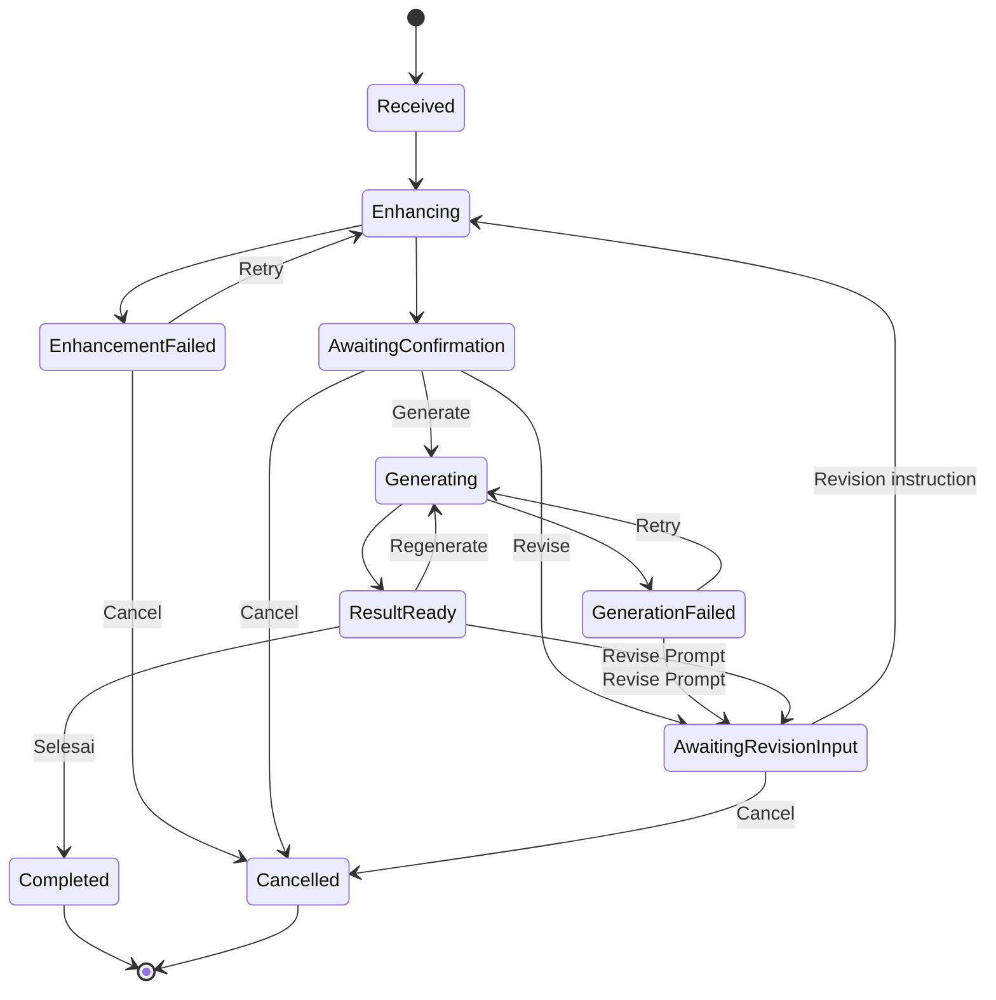

# Telegram Image Bot Implementation Plan

Created: 2026-08-07 12:50:42

## Objective

Membangun bot Telegram yang menerima prompt gambar, memperbaiki prompt melalui reasoning provider OpenAI-compatible, meminta konfirmasi pengguna, menghasilkan gambar melalui image-generation provider, lalu menampilkan hasil di Telegram. Sistem harus dapat di-host pada Vercel free tier, memakai dua Supabase hosted free-tier untuk development dan production, serta mendukung penambahan provider dan API key tanpa mengikat business flow ke satu vendor.

Dokumen ini menjadi spesifikasi handoff untuk implementasi pada repository lain. Repository plan ini tidak akan berisi source aplikasi.

## Scope

- Bot Telegram berbasis webhook, bukan long polling.
- Private chat dan allowlist Telegram user ID untuk versi awal.
- Prompt enhancement melalui reasoning provider.
- Konfirmasi prompt sebelum image generation.
- Revisi prompt sebelum dan sesudah image generation.
- Regenerate gambar dari prompt revision yang sama.
- Penyelesaian sesi secara eksplisit oleh pengguna.
- Provider abstraction untuk capability `reasoning` dan `image_generation`.
- Reasoning adapter pertama memakai protokol OpenAI-compatible.
- Image adapter pertama memakai Pixazo API.
- Multiple provider config dan multiple API key per provider.
- Round-robin, weighted selection, priority failover, dan cooldown key/provider.
- Next.js App Router dan TypeScript strict.
- Deployment Next.js ke Vercel.
- Dua Supabase hosted project: development dan production.
- Database migrations, RLS, functions, triggers, dan grants disimpan dalam Git.
- Manual approval CI untuk migration hosted development dan production.
- Metadata sesi, revisi, attempt, provider request, dan audit event disimpan di Supabase.
- Hasil gambar dikirim langsung ke Telegram dan tidak disimpan di Supabase Storage.
- Milestone implementation dengan acceptance criteria dan bukti verifikasi jelas.

## Out of Scope

- Supabase local development atau Docker local stack.
- Bot publik tanpa allowlist.
- Billing dan pembayaran pengguna.
- Supabase Storage untuk menyimpan gambar.
- Gallery hasil gambar.
- Batch generation banyak gambar dalam satu request.
- Reference image, image-to-image, inpainting, atau editing canvas.
- Voice prompt.
- Telegram group, supergroup, channel, dan inline mode.
- Aplikasi mobile.
- Fine-tuning model.
- Provider adapter tanpa kontrak API resmi.

## Architecture Principles

1. Webhook Telegram harus ringan dan segera mengembalikan HTTP `200` setelah validasi, deduplikasi, dan persistensi job.
2. External inference tidak dijalankan sebagai pekerjaan tidak-terlacak setelah webhook mengirim response.
3. Semua pekerjaan panjang direpresentasikan sebagai durable job di Supabase.
4. Setiap handler harus idempotent karena Telegram, dispatcher, Vercel, dan provider dapat mengirim retry.
5. Domain mengenal capability, bukan nama vendor.
6. Vendor-specific authentication, payload, polling, dan parsing hanya berada di adapter.
7. Provider config disimpan di Supabase; API key disimpan sebagai ciphertext, bukan plaintext.
8. Vercel environment menyimpan root encryption key dan platform secrets.
9. Migration SQL di Git menjadi source of truth database.
10. Migration harus additive dan backward-compatible bila memungkinkan karena rollback Vercel tidak otomatis me-rollback database.
11. Production tidak boleh dipakai oleh Vercel Preview atau bot development.
12. Setiap milestone harus lulus gate otomatis dan manual sebelum milestone berikutnya dimulai.

## Key Decisions

| Area | Decision | Rationale |
|---|---|---|
| Repository | Satu Next.js application repository | V1 hanya memiliki satu deployable engine; monorepo tooling belum memberi manfaat cukup. |
| Runtime | Vercel Node.js Functions | Mendukung Node `crypto`, buffer/multipart, dan kompatibilitas library lebih luas. |
| Telegram updates | HTTPS webhook | Cocok untuk serverless; long polling membutuhkan process hidup terus. |
| Job state | Supabase Postgres | Durable, relational, tersedia pada free tier, dan dapat diaudit. |
| Development DB | Supabase hosted development | Pengguna tidak menginginkan Supabase local. |
| Production DB | Supabase hosted production | Isolasi data, secret, webhook, dan migration dari development. |
| Database delivery | Versioned migrations melalui CI | Mencegah dashboard drift dan membuat perubahan dapat direview. |
| Migration approval | GitHub Environment manual approval | Mengurangi risiko migration langsung ke hosted project. |
| Reasoning protocol | OpenAI-compatible adapter pertama | Provider dengan protokol sama dapat ditambah lewat config tanpa deploy. |
| Image protocol | Pixazo adapter pertama | Vendor awal, tetapi tidak muncul dalam domain orchestration. |
| Image persistence | Tidak disimpan di Supabase Storage | Menghemat free-tier storage dan sesuai kebutuhan saat ini. |
| User access | Private chat dan allowlist | Mencegah abuse dan pemborosan kredit provider. |
| Prompt approval | Konfirmasi pengguna | Pengguna menentukan prompt sudah cukup sebelum memakai image credit. |
| Post-result flow | Regenerate, Revise Prompt, Selesai | Sesi tetap aktif setelah satu hasil gambar. |

## Context Diagram



## Deployment Topology

| Environment | Git source | Vercel | Supabase | Telegram bot |
|---|---|---|---|---|
| Development | Feature branch atau integration branch | Preview deployment dengan alias stabil | Hosted development project | Development bot |
| Production | `main` | Production deployment | Hosted production project | Production bot |

Development webhook harus memakai alias stabil, misalnya:

```text
https://dev-albot.example.com/api/telegram/webhook
```

Production webhook harus memakai domain production, misalnya:

```text
https://albot.example.com/api/telegram/webhook
```

Preview deployment acak tidak boleh menerima webhook bot production.

## Proposed Repository Structure

```text
telegram-image-bot/
├── src/
│   ├── app/
│   │   ├── api/
│   │   │   ├── health/route.ts
│   │   │   ├── jobs/process/route.ts
│   │   │   ├── provider-callbacks/[adapter]/route.ts
│   │   │   └── telegram/webhook/route.ts
│   │   └── admin/
│   │       └── providers/
│   ├── server/
│   │   ├── application/
│   │   │   ├── cancel-session.ts
│   │   │   ├── complete-session.ts
│   │   │   ├── enhance-prompt.ts
│   │   │   ├── generate-image.ts
│   │   │   ├── regenerate-image.ts
│   │   │   └── revise-prompt.ts
│   │   ├── domain/
│   │   │   ├── generation-attempt.ts
│   │   │   ├── prompt-revision.ts
│   │   │   ├── prompt-session.ts
│   │   │   └── provider.ts
│   │   ├── jobs/
│   │   │   ├── handlers/
│   │   │   └── processor.ts
│   │   ├── providers/
│   │   │   ├── contracts/
│   │   │   │   ├── image-generation-provider.ts
│   │   │   │   └── reasoning-provider.ts
│   │   │   ├── image/
│   │   │   │   └── pixazo.adapter.ts
│   │   │   ├── reasoning/
│   │   │   │   └── openai-compatible.adapter.ts
│   │   │   ├── errors.ts
│   │   │   ├── registry.ts
│   │   │   └── selector.ts
│   │   ├── repositories/
│   │   ├── security/
│   │   │   ├── encryption.ts
│   │   │   ├── internal-request-auth.ts
│   │   │   └── telegram-webhook-auth.ts
│   │   ├── supabase/
│   │   │   ├── admin.ts
│   │   │   └── database.types.ts
│   │   └── telegram/
│   │       ├── callbacks.ts
│   │       ├── client.ts
│   │       └── messages.ts
│   └── env.ts
├── supabase/
│   ├── config.toml
│   ├── migrations/
│   └── seed/
├── tests/
│   ├── contract/
│   ├── integration/
│   ├── security/
│   └── unit/
├── scripts/
│   ├── check-provider-config.ts
│   ├── set-telegram-webhook.ts
│   └── verify-deployment.ts
├── .github/workflows/
│   ├── migrate-development.yml
│   ├── migrate-production.yml
│   └── validate.yml
├── .env.example
├── next.config.ts
├── package.json
├── tsconfig.json
└── vercel.json
```

## Component Responsibilities

| Component | Responsibility | Must not do |
|---|---|---|
| Telegram webhook | Validate request, deduplicate update, enforce access rules, persist event/job, return quickly | Call reasoning or image provider synchronously as untracked work |
| Job processor | Claim durable job, invoke application use case, update state, schedule continuation | Parse raw Telegram request or contain vendor payload mapping |
| Application use case | Enforce session transitions and coordinate repositories/providers | Depend on Pixazo-specific response shape |
| Provider registry | Resolve adapter factory by `adapter_type` and capability | Read Telegram state |
| Provider selector | Select active provider and key using policy | Build vendor HTTP payload |
| Provider adapter | Translate domain request to vendor protocol and normalize response/error | Modify session state directly |
| Repository | Read/write Supabase rows and invoke safe DB functions | Send Telegram messages or provider requests |
| Telegram client | Send/edit Telegram messages and answer callbacks | Query database directly |
| Admin interface | Manage provider metadata, encrypted keys, activation, priority, and allowlist | Expose decrypted key values |

## User Experience Flow

### Initial Prompt

1. User mengirim prompt text melalui private chat.
2. Bot memeriksa allowlist, rate limit, dan panjang prompt.
3. Bot membuat `prompt_session`, initial `prompt_revision`, dan enhancement job.
4. Bot memberi status bahwa prompt sedang diperbaiki.
5. Reasoning provider menghasilkan enhanced prompt.
6. Bot menampilkan enhanced prompt dengan tombol:

```text
[Generate] [Revise Lagi] [Batal]
```

### Revision Before Generation

1. User menekan `Revise Lagi`.
2. Bot meminta instruksi revisi.
3. User mengirim instruksi, misalnya `Ubah ke suasana malam dan rasio 16:9`.
4. Reasoning provider menerima source prompt, previous enhanced prompt, dan revision instruction.
5. Bot membuat revision baru tanpa menimpa revision lama.
6. Bot menampilkan enhanced prompt terbaru untuk konfirmasi ulang.

### Image Generation

1. User menekan `Generate`.
2. Bot membuat `generation_attempt` yang menunjuk active revision.
3. Image provider dipilih berdasarkan capability dan selection policy.
4. Adapter menjalankan request synchronous atau membuat provider request asynchronous.
5. Hasil gambar dikirim ke Telegram.
6. Bot menampilkan tombol:

```text
[Regenerate] [Revise Prompt] [Selesai]
```

### Regenerate

1. User menekan `Regenerate`.
2. Bot membuat `generation_attempt` baru.
3. Attempt baru memakai revision dan parameter yang sama, kecuali provider membutuhkan random seed baru.
4. Prompt revision lama tidak berubah.
5. Hasil baru dikirim bersama tombol result actions yang sama.

### Revise After Generation

1. User menekan `Revise Prompt`.
2. Bot meminta revision instruction.
3. Reasoning provider membuat prompt revision baru berdasarkan active revision.
4. Bot meminta konfirmasi ulang.
5. Generation berikutnya menunjuk revision baru.

### Complete

1. User menekan `Selesai`.
2. Sesi berubah ke terminal state `completed`.
3. Callback lama ditolak.
4. User dapat memulai sesi baru dengan prompt baru.

## Session State Model



Valid session states:

```text
received
enhancing
awaiting_confirmation
awaiting_revision_input
generating
result_ready
enhancement_failed
generation_failed
completed
cancelled
expired
```

State transition harus dilakukan secara conditional, misalnya update hanya berhasil bila current state sesuai expected state. Ini mencegah double-click dan concurrent worker mengubah state dua kali.

## Provider Abstraction

### Reasoning Contract

```ts
export interface ReasoningProvider {
  enhancePrompt(input: EnhancePromptInput): Promise<EnhancedPrompt>;
}

export type EnhancePromptInput = {
  sourcePrompt: string;
  previousPrompt?: string;
  revisionInstruction?: string;
  systemPrompt: string;
  options: Record<string, unknown>;
};

export type EnhancedPrompt = {
  prompt: string;
  negativePrompt?: string;
  aspectRatio?: string;
  metadata: Record<string, unknown>;
};
```

### Image Generation Contract

```ts
export interface ImageGenerationProvider {
  generateImage(input: GenerateImageInput): Promise<ImageGenerationResult>;
  getResult?(providerRequestId: string): Promise<ImageGenerationResult>;
}

export type GenerateImageInput = {
  prompt: string;
  negativePrompt?: string;
  aspectRatio?: string;
  parameters: Record<string, unknown>;
};

export type ImageGenerationResult =
  | {
      status: "completed";
      imageUrl?: string;
      imageBytes?: Uint8Array;
      mimeType?: string;
      providerRequestId?: string;
      metadata: Record<string, unknown>;
    }
  | {
      status: "pending";
      providerRequestId: string;
      pollAfterMs: number;
      metadata: Record<string, unknown>;
    };
```

### Registry Rule

Registry memetakan `adapter_type` ke factory:

```ts
const reasoningFactories = {
  openai_compatible: createOpenAICompatibleProvider,
};

const imageFactories = {
  pixazo: createPixazoProvider,
};
```

Job processor tidak boleh memakai kondisi vendor seperti:

```ts
if (provider.name === "pixazo") {
  // vendor logic
}
```

Provider baru dengan protokol OpenAI-compatible hanya memerlukan row config dan key baru. Provider dengan protokol berbeda memerlukan adapter, contract tests, registry entry, config, dan deployment baru.

## Provider Selection

Pemilihan dilakukan dalam dua tingkat:

1. Pilih `provider_config` berdasarkan capability.
2. Pilih active API key untuk provider config tersebut.

Supported strategy:

```text
round_robin
weighted_round_robin
priority_failover
```

Selection filters:

- Capability cocok.
- Provider aktif.
- Key aktif.
- `cooldown_until` kosong atau sudah lewat.
- Provider dan model memenuhi request requirements.
- Attempt count belum melewati limit.

Retryable failures:

```text
HTTP 408
HTTP 429
HTTP 500
HTTP 502
HTTP 503
HTTP 504
network timeout
temporary DNS or connection failure
```

Non-retryable failures:

```text
HTTP 400 malformed request
HTTP 401 invalid key
HTTP 403 forbidden account or model
prompt rejected by content policy
unsupported parameter
invalid model
```

`401` harus meningkatkan failure count dan membuat key tidak dipilih sampai diperiksa. Failover lintas provider tidak boleh menyamarkan malformed request atau prompt-policy rejection.

## Data Model

### `bot_users`

```text
id uuid primary key
telegram_user_id bigint unique not null
telegram_chat_id bigint
username text
is_allowed boolean not null default false
is_admin boolean not null default false
created_at timestamptz not null
updated_at timestamptz not null
last_seen_at timestamptz
```

### `provider_configs`

```text
id uuid primary key
capability text not null
adapter_type text not null
name text not null
base_url text not null
model text
settings jsonb not null default '{}'
selection_strategy text not null default 'priority_failover'
priority integer not null default 100
weight integer not null default 1
is_active boolean not null default true
config_version integer not null default 1
created_at timestamptz not null
updated_at timestamptz not null
```

Constraints:

```text
capability in ('reasoning', 'image_generation')
priority >= 0
weight > 0
```

### `provider_keys`

```text
id uuid primary key
provider_config_id uuid not null references provider_configs(id)
key_ciphertext text not null
key_iv text not null
key_auth_tag text not null
key_fingerprint text not null
label text
weight integer not null default 1
is_active boolean not null default true
failure_count integer not null default 0
cooldown_until timestamptz
last_used_at timestamptz
created_at timestamptz not null
updated_at timestamptz not null
```

Plaintext key tidak boleh dikembalikan oleh repository atau admin API. Decryption hanya dilakukan sesaat sebelum request provider dan hasil tidak boleh di-log.

### `prompt_sessions`

```text
id uuid primary key
telegram_user_id bigint not null
telegram_chat_id bigint not null
status text not null
active_revision_id uuid
active_generation_attempt_id uuid
telegram_status_message_id bigint
created_at timestamptz not null
updated_at timestamptz not null
expires_at timestamptz not null
completed_at timestamptz
```

### `prompt_revisions`

```text
id uuid primary key
session_id uuid not null references prompt_sessions(id)
revision_number integer not null
source_prompt text not null
previous_prompt text
revision_instruction text
enhanced_prompt text
negative_prompt text
aspect_ratio text
reasoning_provider_config_id uuid references provider_configs(id)
status text not null
created_at timestamptz not null
completed_at timestamptz
unique(session_id, revision_number)
```

### `generation_attempts`

```text
id uuid primary key
session_id uuid not null references prompt_sessions(id)
revision_id uuid not null references prompt_revisions(id)
attempt_number integer not null
status text not null
image_provider_config_id uuid references provider_configs(id)
provider_request_id text
parameters jsonb not null default '{}'
telegram_message_id bigint
error_code text
error_message text
started_at timestamptz
completed_at timestamptz
created_at timestamptz not null
unique(session_id, attempt_number)
```

### `provider_requests`

```text
id uuid primary key
job_id uuid
provider_config_id uuid not null references provider_configs(id)
provider_key_id uuid references provider_keys(id)
capability text not null
provider_request_id text
status text not null
http_status integer
latency_ms integer
error_code text
error_message_redacted text
created_at timestamptz not null
completed_at timestamptz
```

### `jobs`

```text
id uuid primary key
job_type text not null
session_id uuid references prompt_sessions(id)
revision_id uuid references prompt_revisions(id)
generation_attempt_id uuid references generation_attempts(id)
status text not null
payload jsonb not null default '{}'
attempt_count integer not null default 0
max_attempts integer not null default 3
available_at timestamptz not null
locked_at timestamptz
locked_by text
last_error_code text
last_error_message_redacted text
created_at timestamptz not null
updated_at timestamptz not null
completed_at timestamptz
```

### `telegram_updates`

```text
id uuid primary key
update_id bigint unique not null
telegram_user_id bigint
telegram_chat_id bigint
update_type text not null
received_at timestamptz not null
processed_at timestamptz
```

Raw update tidak harus disimpan. Jika disimpan untuk debugging, lakukan redaction dan retention pendek.

### `callback_events`

```text
id uuid primary key
callback_query_id text unique not null
session_id uuid references prompt_sessions(id)
action text not null
telegram_user_id bigint not null
received_at timestamptz not null
processed_at timestamptz
```

### `job_events`

```text
id uuid primary key
job_id uuid references jobs(id)
session_id uuid references prompt_sessions(id)
event_type text not null
payload jsonb not null default '{}'
created_at timestamptz not null
```

Event payload tidak boleh berisi API key, Telegram token, service role key, atau decrypted credential.

## Database Constraints and Indexes

Required unique constraints:

- `telegram_updates(update_id)`
- `callback_events(callback_query_id)`
- `prompt_revisions(session_id, revision_number)`
- `generation_attempts(session_id, attempt_number)`
- Provider key fingerprint unik dalam satu provider config.

Required indexes:

- `jobs(status, available_at)` untuk worker claim.
- `jobs(locked_at)` untuk lease recovery.
- `prompt_sessions(telegram_user_id, status)` untuk active-session lookup.
- `provider_configs(capability, is_active, priority)` untuk selection.
- `provider_keys(provider_config_id, is_active, cooldown_until, last_used_at)` untuk key selection.
- `provider_requests(provider_config_id, created_at)` untuk diagnostics.
- `job_events(session_id, created_at)` untuk audit timeline.

## Job Processing Design

Webhook memasukkan job lalu mengembalikan response. Dispatcher memanggil internal Vercel processor. Processor melakukan atomic claim melalui database function atau transaction dengan `FOR UPDATE SKIP LOCKED`.

Claim conditions:

- Status `queued` atau retryable state.
- `available_at <= now()`.
- Lock kosong atau lease sudah expired.
- `attempt_count < max_attempts`.

Lease fields:

```text
locked_at
locked_by
attempt_count
```

Worker completion harus conditional terhadap lock owner. Worker lama tidak boleh menyelesaikan job setelah lease diambil worker baru.

Backoff example:

```text
attempt 1: 5 seconds
attempt 2: 30 seconds
attempt 3: 2 minutes
```

Jitter perlu ditambahkan agar banyak retry tidak berjalan bersamaan.

## Dispatcher Options

Preferred order:

1. Supabase Database Webhook memanggil Vercel job processor saat job tersedia.
2. `pg_net` dipanggil melalui controlled database function.
3. Scheduled recovery poll untuk job yang tidak ter-dispatch atau lease expired.

Database webhook bukan queue guarantee. Durable source tetap row `jobs`; recovery poll wajib menemukan job yang tertinggal.

Internal processor endpoint harus memvalidasi signed request atau strong shared secret. Jangan hanya mengandalkan URL yang sulit ditebak.

## OpenAI-Compatible Reasoning Behavior

Input harus meminta structured output. Contoh normalized result:

```json
{
  "enhanced_prompt": "Cinematic portrait...",
  "negative_prompt": "blurry, low detail",
  "aspect_ratio": "1:1",
  "notes": "Optional concise notes"
}
```

Validation requirements:

- `enhanced_prompt` wajib non-empty.
- Panjang prompt dibatasi.
- `aspect_ratio` harus masuk allowlist atau diabaikan.
- Provider output invalid dapat diperbaiki satu kali atau dianggap non-retryable setelah batas.
- Chain-of-thought atau reasoning internal tidak ditampilkan atau disimpan.
- Revision input harus menyertakan previous prompt dan user revision instruction.

## Pixazo Adapter Discovery Checklist

Sebelum adapter dibuat, konfirmasi dokumentasi resmi berikut:

- Base URL.
- Authentication header.
- Model identifier.
- Generate endpoint.
- Required dan optional request fields.
- Aspect ratio atau width/height mapping.
- Negative prompt support.
- Synchronous atau asynchronous response.
- Polling endpoint dan terminal statuses.
- Provider callback/webhook support.
- Output URL lifetime.
- Output mime type dan maximum size.
- Rate-limit headers.
- Error response schema.
- Idempotency-key support.
- Content-policy error behavior.

Jika Pixazo output URL berumur pendek, Telegram delivery harus dilakukan segera. Failure delivery tidak selalu dapat dipulihkan tanpa menyimpan image. Risiko ini diterima untuk V1 dan harus terlihat dalam user-facing retry behavior.

## Telegram Callback Design

Callback data harus pendek dan tidak memuat prompt atau secret. Gunakan opaque action token atau compact identifier.

Logical actions:

```text
generate
revise
cancel
regenerate
complete
retry_enhancement
retry_generation
```

Server validation:

- `callback_query_id` belum pernah diproses.
- Telegram user sama dengan pemilik session.
- Session belum expired.
- Session berada pada state yang menerima action tersebut.
- Revision dalam callback masih active revision bila action membutuhkannya.
- Tidak ada active generation bila action membuat attempt baru.

Server harus memanggil Telegram `answerCallbackQuery` cepat agar loading indicator berhenti, tanpa menunggu inference selesai.

## Telegram Message Rules

- Escape dynamic text bila memakai MarkdownV2.
- Prompt panjang dipotong untuk caption dan dikirim sebagai message terpisah bila perlu.
- Jangan menaruh raw provider error dalam pesan pengguna.
- Progress message dapat diedit untuk mengurangi spam.
- Gambar hasil memakai `sendPhoto` jika ukuran dan format didukung.
- Gunakan `sendDocument` sebagai fallback hanya bila UX dan Telegram limits mengharuskan.
- Jika Telegram dapat mengambil URL langsung, pertimbangkan `sendPhoto` dengan URL agar response body Vercel tidak membawa image besar.
- Vercel function request/response body limit harus diperiksa sebelum proxying bytes.

## Security Model

### Secrets in Vercel

```text
SUPABASE_URL
SUPABASE_SERVICE_ROLE_KEY
TELEGRAM_BOT_TOKEN
TELEGRAM_WEBHOOK_SECRET
JOB_PROCESSOR_SECRET
PROVIDER_KEY_ENCRYPTION_KEY
```

Development dan production harus memiliki nilai berbeda.

### Provider Key Encryption

- API key masuk melalui authenticated admin path.
- Server mengenkripsi key menggunakan authenticated encryption, misalnya AES-256-GCM.
- Ciphertext, IV, auth tag, dan fingerprint disimpan di Supabase.
- Root encryption key hanya berada di Vercel environment.
- Decryption hanya di server memory tepat sebelum outbound request.
- Admin UI hanya menampilkan fingerprint dan label.
- Rotation membuat row key baru, mengaktifkannya, lalu menonaktifkan key lama setelah verifikasi.

Limitation: siapa pun dengan akses ke Vercel production environment dan service role tetap dapat membangun jalur decryption. Access control platform dan audit tetap diperlukan.

### Supabase RLS

- `anon` tidak memiliki akses ke internal bot tables.
- Browser admin memakai authenticated user dan role/policy terbatas bila admin UI dibuat.
- Service role hanya dipakai server-side.
- Service role key tidak memakai prefix `NEXT_PUBLIC_`.
- Provider key ciphertext tidak boleh tersedia pada browser query.
- Database function security-definer harus memakai fixed `search_path` dan grants minimum.

### Telegram Security

- Validasi `X-Telegram-Bot-Api-Secret-Token` dengan constant-time comparison bila relevan.
- Hanya menerima `POST` pada webhook.
- Batasi `allowed_updates` ke `message` dan `callback_query`.
- Reject group/channel update pada V1.
- Allowlist berdasarkan numeric Telegram user ID, bukan username.
- Deduplicate `update_id` dan `callback_query_id`.

### Abuse Controls

Initial limits, dapat dikonfigurasi:

```text
maximum prompt length: 4000 characters
maximum active session per user: 1
maximum prompt submissions: 5 per 10 minutes
maximum provider attempts per job: 3
session expiry: 30 minutes of inactivity
```

## Environment Validation

`src/env.ts` harus memvalidasi environment sebelum handler menjalankan side effect.

```ts
const serverEnvSchema = z.object({
  SUPABASE_URL: z.string().url(),
  SUPABASE_SERVICE_ROLE_KEY: z.string().min(1),
  TELEGRAM_BOT_TOKEN: z.string().min(1),
  TELEGRAM_WEBHOOK_SECRET: z.string().regex(/^[A-Za-z0-9_-]+$/),
  JOB_PROCESSOR_SECRET: z.string().min(32),
  PROVIDER_KEY_ENCRYPTION_KEY: z.string().min(32),
});
```

Exact encryption key length/encoding harus divalidasi sesuai algorithm, misalnya base64 yang decode menjadi 32 bytes.

## Database Migration Policy

1. Semua schema changes dibuat sebagai file migration baru.
2. Production dashboard tidak dipakai untuk perubahan schema manual.
3. Migration development diterapkan melalui GitHub workflow dengan approval.
4. Integration tests berjalan terhadap hosted development setelah migration.
5. Production workflow hanya menerima migration yang sudah tercatat lulus di development.
6. Production migration membutuhkan approval terpisah.
7. Destructive migration tidak digabung dengan application rollout yang bergantung padanya.
8. Column removal dilakukan setelah seluruh deployed code berhenti menggunakannya.
9. Constraint ketat ditambahkan setelah data existing diverifikasi atau dibersihkan.
10. Rollback utama memakai forward-fix migration, bukan menghapus migration history.

Recommended release sequence:

1. Tambah nullable column/table/index.
2. Deploy code yang dapat bekerja dengan schema lama dan baru bila rolling overlap mungkin terjadi.
3. Mulai menulis data baru.
4. Verifikasi production data.
5. Tambah constraint atau remove old structure pada release berikutnya.

## CI/CD Workflows

### `validate.yml`

Trigger: pull request dan push.

Checks:

```text
npm ci
npm run lint
npm run typecheck
npm run test:unit
npm run test:contract
npm run build
SQL lint
migration static safety scan
secret scan
dependency audit appropriate for CI
```

### `migrate-development.yml`

Trigger: manual dispatch atau approved workflow after PR review.

Steps:

1. Require GitHub Environment `development` approval.
2. Checkout exact commit SHA.
3. Apply pending migrations to hosted development.
4. Generate or verify TypeScript database types.
5. Run integration and RLS tests against hosted development.
6. Record commit SHA, migration version, run URL, and result as evidence.

### `migrate-production.yml`

Trigger: manual dispatch from `main` only.

Steps:

1. Verify exact migration set passed development.
2. Require GitHub Environment `production` approval.
3. Capture current migration version and schema metadata.
4. Apply pending migrations to hosted production.
5. Run read-only schema smoke tests.
6. Record evidence.
7. Continue or authorize Vercel production deployment.

## Testing Strategy

### Unit Tests

- Domain state transitions.
- Provider selection policies.
- Retry classification.
- Callback validation.
- Encryption round trip and tamper rejection.
- Prompt output validation.
- Rate-limit calculation.
- Telegram message formatting and escaping.

### Contract Tests

- OpenAI-compatible request and response normalization.
- Pixazo request and response normalization.
- Provider polling status mapping.
- Telegram Bot API request mapping.
- Vendor errors mapped to stable domain errors.

Use controlled mock HTTP server or request interceptor. Contract tests tidak memakai paid production provider secara default.

### Hosted Integration Tests

- Repository CRUD against Supabase development.
- RLS deny tests using anon/publishable key.
- Atomic job claim under concurrent calls.
- Provider key selection concurrency.
- Duplicate Telegram update behavior.
- Duplicate callback behavior.
- Conditional session transition.
- Migration compatibility and generated types.

### End-to-End Tests

- Development Telegram bot sends initial prompt.
- Enhanced prompt appears.
- Revision before generate works.
- Generate returns image.
- Regenerate returns another image using same revision.
- Revise after image creates new revision.
- Complete closes session.
- Non-allowlisted user cannot call providers.

Paid provider E2E should use explicit test command and small quota, not run on every pull request.

## Observability

Structured log fields:

```text
environment
request_id
telegram_update_id
session_id
revision_id
generation_attempt_id
job_id
provider_config_id
provider_request_id
status
latency_ms
error_code
```

Never log:

```text
Telegram bot token
Telegram webhook secret
Supabase service role key
provider plaintext API key
provider authorization header
encryption root key
full raw database connection string
```

Metrics derivable from database and logs:

- Enhancement success/failure rate.
- Generation success/failure rate.
- Provider latency by config.
- `429` and timeout count.
- Key cooldown count.
- Telegram delivery failure count.
- Jobs queued, running, retrying, and dead.
- Generation attempts per session.

## Milestones

1. Repository foundation and hosted environment wiring.
2. Database foundation and migration pipeline.
3. Provider abstraction, encrypted config, and selection.
4. Telegram intake, allowlist, and durable job creation.
5. Prompt enhancement, confirmation, and revision.
6. Image generation, regenerate, revise-after-result, and complete.
7. Reliability, recovery, security hardening, and observability.
8. Production release and operational handoff.

## Tasks

- [x] Capture architecture decisions and hosted-only Supabase constraint.
- [x] Define provider-neutral reasoning and image-generation contracts.
- [x] Define regenerate and revise-after-result behavior.
- [x] Define milestone gates and verification evidence format.
- [ ] Create implementation repository and initialize Next.js foundation.
- [ ] Provision hosted Supabase development and production projects.
- [ ] Provision Telegram development and production bots.
- [ ] Configure Vercel Preview and Production environments.
- [x] Implement Milestone 0 and record verification evidence.
- [ ] Implement Milestone 1 and record verification evidence.
- [ ] Implement Milestone 2 and record verification evidence.
- [ ] Implement Milestone 3 and record verification evidence.
- [ ] Implement Milestone 4 and record verification evidence.
- [ ] Implement Milestone 5 and record verification evidence.
- [ ] Implement Milestone 6 and record verification evidence.
- [ ] Implement Milestone 7 and record verification evidence.
- [ ] Execute production release checklist and operational handoff.

## Milestone 0: Repository Foundation

### Goal

Membuat skeleton Next.js yang dapat di-build, di-test, dan di-deploy tanpa business feature.

### Deliverables

- Next.js App Router project.
- TypeScript strict mode.
- ESLint dan formatter.
- Environment schema validation.
- `/api/health` route.
- Supabase server client wrapper.
- Baseline unit test setup.
- Vercel project configuration.
- GitHub validation workflow.
- `.env.example` tanpa secret.
- Development dan production environment variable inventory.

### Implementation Tasks

- [x] Initialize package manager dan lockfile.
- [x] Create Next.js app with `src/` layout.
- [x] Enable strict TypeScript and path aliases.
- [x] Add lint, typecheck, test, and build scripts.
- [x] Add validated server environment module.
- [x] Add health endpoint with non-sensitive DB reachability check.
- [x] Add test framework and one passing baseline test.
- [x] Add Vercel configuration and Node.js runtime defaults.
- [x] Add GitHub Actions validation workflow.
- [x] Add secret scanning rule/tool.
- [ ] Connect Vercel Preview only to development Supabase variables.
- [ ] Connect Vercel Production only to production Supabase variables.

### Verification

```bash
npm ci
npm run lint
npm run typecheck
npm test
npm run build
```

Hosted verification:

```http
GET https://<development-alias>/api/health
```

Expected sanitized response:

```json
{
  "status": "ok",
  "environment": "development",
  "database": "reachable"
}
```

### Acceptance Criteria

- [ ] All local static checks pass.
- [ ] CI passes from clean checkout.
- [ ] Vercel Preview deployment succeeds.
- [ ] Health endpoint reaches hosted Supabase development.
- [ ] Preview has no production credentials.
- [ ] No secret exists in Git history introduced by milestone.
- [ ] Health response exposes no project key or connection detail.

### Evidence Required

- Commit SHA.
- CI run URL.
- Vercel Preview URL.
- Health response screenshot or captured sanitized output.
- Secret scan result.

## Milestone 1: Database Foundation

### Goal

Menyediakan schema inti, strict RLS, atomic job primitives, generated TypeScript types, dan hosted migration workflow.

### Deliverables

- Versioned migrations for all core tables.
- Constraints and indexes.
- RLS deny-by-default policies.
- Minimal grants.
- Atomic job claim database function.
- Conditional session transition database function or equivalent transaction pattern.
- Development and production migration workflows.
- Generated database TypeScript types.
- Hosted integration test harness.

### Implementation Tasks

- [ ] Create initial enum/check-constraint strategy.
- [ ] Create `bot_users`.
- [ ] Create `provider_configs` and `provider_keys`.
- [ ] Create `prompt_sessions` and `prompt_revisions`.
- [ ] Create `generation_attempts`.
- [ ] Create `jobs`, `provider_requests`, and `job_events`.
- [ ] Create `telegram_updates` and `callback_events`.
- [ ] Add timestamps and update triggers only where justified.
- [ ] Add required unique constraints and indexes.
- [ ] Enable RLS on every exposed table.
- [ ] Add deny policies for anon/browser access.
- [ ] Add safe job claim function with fixed `search_path`.
- [ ] Add conditional state-transition operation.
- [ ] Add migration development workflow with manual approval.
- [ ] Add migration production workflow with manual approval.
- [ ] Generate and commit TypeScript database types.
- [ ] Add integration tests against hosted development.

### Verification

- Apply migrations to hosted development through approved workflow.
- Run migration command again and verify no pending duplicate migration.
- Run schema assertions for tables, columns, constraints, and indexes.
- Attempt table reads with anon/publishable key and verify denial/no rows.
- Verify server-side repository test with service role.
- Run concurrent claim test with at least two workers and one queued job.
- Verify exactly one worker receives job.
- Regenerate database types and verify clean Git diff.
- Run application typecheck and build.

### Acceptance Criteria

- [ ] Hosted development migration succeeds.
- [ ] Migration version is recorded.
- [ ] Schema assertions pass.
- [ ] RLS and grant tests pass.
- [ ] Atomic claim test proves single ownership.
- [ ] Conditional state transition rejects stale state.
- [ ] Generated types match hosted development schema.
- [ ] No migration has been applied to production yet.
- [ ] No schema change exists only in dashboard.

### Evidence Required

- Development migration workflow URL.
- Supabase migration version.
- Integration test report.
- RLS test output.
- Concurrent claim test output.
- Generated types diff status.

## Milestone 2: Provider Abstraction and Configuration

### Goal

Membuat provider-neutral engine, encrypted key management, provider/key selection, retry classification, dan adapters yang dapat diuji tanpa Telegram.

### Deliverables

- Reasoning and image-generation contracts.
- Provider config validation.
- Provider registry.
- Provider and key selector.
- Authenticated encryption service.
- Provider-neutral error taxonomy.
- OpenAI-compatible reasoning adapter.
- Pixazo adapter skeleton or full adapter after API contract confirmation.
- Mock adapters and contract tests.
- Admin-safe config repository methods.

### Implementation Tasks

- [ ] Define domain input/output types.
- [ ] Define normalized provider errors.
- [ ] Implement config parser per adapter type.
- [ ] Implement registry with clear unknown-adapter error.
- [ ] Implement AES-GCM encryption/decryption and fingerprinting.
- [ ] Implement provider key insertion without plaintext return.
- [ ] Implement round-robin key selection.
- [ ] Implement weighted provider selection.
- [ ] Implement priority failover.
- [ ] Implement cooldown and failure tracking.
- [ ] Implement retry classification.
- [ ] Implement OpenAI-compatible request/response normalization.
- [ ] Confirm Pixazo API contract.
- [ ] Implement Pixazo request/response normalization.
- [ ] Add mock reasoning and image adapters.
- [ ] Add unit and contract tests.

### Verification

Required unit scenarios:

- Active reasoning config resolves reasoning adapter.
- Image config cannot resolve reasoning adapter.
- Inactive provider is not selected.
- Cooldown key is skipped.
- Round-robin advances key selection.
- Weight influences selection across deterministic test sequence.
- Unknown adapter fails before outbound HTTP.
- Corrupted ciphertext fails authentication.
- Plaintext key never appears in serialized config.
- `401` is non-retryable for same key and marks key unhealthy.
- `429` is retryable and activates cooldown.
- `5xx` follows bounded failover.
- Malformed provider output becomes stable domain error.

Required contract scenarios:

- OpenAI-compatible payload matches provider contract.
- OpenAI-compatible structured response maps correctly.
- Pixazo payload matches confirmed API contract.
- Pixazo sync result maps to `completed`.
- Pixazo async result maps to `pending` if supported.
- Provider-specific errors do not escape application boundary.

### Acceptance Criteria

- [ ] Application/domain modules contain no Pixazo-specific branch.
- [ ] Telegram modules are not imported by provider adapters.
- [ ] New OpenAI-compatible provider can be added using database config only.
- [ ] New protocol requires only adapter, config schema, registry entry, and tests.
- [ ] Provider keys are ciphertext in database.
- [ ] Decrypted values never appear in logs or API responses.
- [ ] Unit and contract test suites pass.

### Evidence Required

- Test report.
- Example redacted provider config.
- Database row showing ciphertext and fingerprint only.
- Source search proving vendor name limited to adapter/registry/tests/config fixtures.

## Milestone 3: Telegram Intake and Durable Jobs

### Goal

Menerima Telegram update secara aman, membatasi akses, mencegah duplikasi, dan membuat durable session/job tanpa memanggil inference dalam webhook.

### Deliverables

- Telegram webhook route.
- Secret-token validation.
- Message and callback parsing.
- Private-chat restriction.
- Allowlist check.
- Prompt validation and rate limit.
- Telegram update deduplication.
- Initial session, revision, and job creation transaction.
- Telegram development webhook setup script.
- Internal job processor authentication shell.

### Implementation Tasks

- [ ] Implement webhook request schema validation.
- [ ] Validate Telegram secret header.
- [ ] Reject unsupported HTTP methods.
- [ ] Parse text messages and callback queries.
- [ ] Reject group/channel contexts.
- [ ] Check numeric user ID allowlist.
- [ ] Apply prompt length and active-session limits.
- [ ] Implement rate limit persistence/check.
- [ ] Insert unique `telegram_updates` row.
- [ ] Atomically create session, revision, and enhancement job.
- [ ] Send concise acknowledgement.
- [ ] Add webhook setup and inspect scripts.
- [ ] Configure development bot webhook with limited updates.

### Verification

| Scenario | Expected result |
|---|---|
| Missing webhook secret | HTTP `401`, no DB row |
| Wrong webhook secret | HTTP `401`, no DB row |
| Unsupported update | HTTP `200`, safely ignored or logged |
| Non-allowlisted user | Access-denied message, no provider job |
| Group message | Rejected, no provider job |
| Prompt over limit | Validation response, no provider job |
| Same `update_id` twice | One session and one enhancement job |
| Valid prompt | Fast HTTP `200`, one durable job |
| Rate limit exceeded | User feedback, no new provider job |

Measure webhook latency without inference. Target should remain comfortably below Telegram retry threshold; exact SLO set after deployment observation.

### Acceptance Criteria

- [ ] Webhook never waits for reasoning/image generation.
- [ ] Duplicate update produces no duplicate session/job.
- [ ] Non-allowlisted user cannot spend provider credit.
- [ ] Only private chat is accepted.
- [ ] Validation failures are user-readable and safe.
- [ ] Development webhook uses development bot and development Vercel alias.
- [ ] Production webhook remains unset.

### Evidence Required

- Automated webhook test report.
- Sanitized DB row counts for duplicate test.
- Development `getWebhookInfo` output.
- Measured webhook response latency.

## Milestone 4: Prompt Enhancement, Confirmation, and Revision

### Goal

Memproses enhancement job, menampilkan enhanced prompt, dan mendukung revision loop sebelum image generation.

### Deliverables

- Job processor and enhancement handler.
- Atomic job claim and lease handling.
- Reasoning provider invocation.
- Structured prompt validation.
- Telegram confirmation message.
- `Generate`, `Revise Lagi`, and `Batal` callbacks.
- Revision-input mode.
- Revision history.
- Callback deduplication and ownership validation.

### Implementation Tasks

- [ ] Implement authenticated job processor route.
- [ ] Implement job claim and heartbeat/lease behavior as needed.
- [ ] Implement enhancement application use case.
- [ ] Select reasoning provider and key.
- [ ] Persist provider request metadata.
- [ ] Normalize and validate enhanced prompt.
- [ ] Set active revision and awaiting-confirmation state.
- [ ] Send enhanced prompt and action buttons.
- [ ] Implement callback acknowledgement.
- [ ] Implement `Revise Lagi` transition.
- [ ] Capture next user text as revision instruction.
- [ ] Create new immutable revision.
- [ ] Implement `Batal` terminal transition.
- [ ] Implement enhancement retry and user-facing error.

### Verification

Happy path:

1. Send initial prompt.
2. Verify enhancement job claimed once.
3. Verify enhanced prompt appears.
4. Press `Revise Lagi`.
5. Send revision instruction.
6. Verify second revision appears.
7. Verify revision 1 remains unchanged.
8. Press `Generate` and verify session reaches generation-ready path.

Failure and concurrency scenarios:

- Reasoning timeout.
- Reasoning `429` with another key available.
- Reasoning `401` on selected key.
- Invalid structured output.
- Double-click `Revise Lagi`.
- Callback replay.
- Callback from another Telegram user.
- Callback after session expiry.
- Worker crash after provider success but before Telegram send.

### Acceptance Criteria

- [ ] Original and enhanced prompts remain auditable by revision.
- [ ] Every revision gets monotonically increasing revision number.
- [ ] User confirmation required before image generation.
- [ ] Double callback creates at most one transition/revision request.
- [ ] Callback owner mismatch is rejected.
- [ ] Reasoning provider can be replaced through config.
- [ ] Retry is bounded and follows error classification.
- [ ] Job recovers after lease expiry.

### Evidence Required

- Unit/integration test reports.
- Sanitized session/revision timeline.
- Telegram development screenshots for enhancement and revision.
- Provider failover test evidence.

## Milestone 5: Image Generation and Post-Result Actions

### Goal

Menghasilkan gambar, mengirim hasil ke Telegram, lalu menjaga sesi aktif untuk regenerate, revise prompt, atau complete.

### Deliverables

- Image generation application use case.
- Pixazo adapter completed against official API.
- Async polling continuation if Pixazo requires it.
- Telegram image delivery.
- `Regenerate`, `Revise Prompt`, and `Selesai` callbacks.
- Immutable generation attempt history.
- Delivery retry behavior.
- No Supabase image storage.

### Implementation Tasks

- [ ] Implement generation job handler.
- [ ] Select image provider and key by capability.
- [ ] Persist generation attempt before outbound request.
- [ ] Add provider idempotency key if supported.
- [ ] Handle synchronous completed response.
- [ ] Handle asynchronous pending response and schedule poll job if required.
- [ ] Send image via Telegram using URL or bytes based on confirmed limits.
- [ ] Mark result ready only after delivery outcome is known.
- [ ] Add result action buttons.
- [ ] Implement regenerate as new attempt using same revision.
- [ ] Implement revise-after-result as new revision workflow.
- [ ] Implement complete terminal transition.
- [ ] Implement delivery retry without provider regeneration when output remains available.
- [ ] Redact provider and delivery errors.

### Verification

Primary E2E scenario:

1. Generate image from revision 1.
2. Verify image appears in Telegram.
3. Press `Regenerate`.
4. Verify attempt 2 points to revision 1.
5. Press `Revise Prompt`.
6. Send revision instruction and confirm enhanced revision 2.
7. Generate again.
8. Verify attempt 3 points to revision 2.
9. Press `Selesai`.
10. Verify session is terminal and old actions are rejected.

Expected relational state:

```text
1 prompt_session
2 prompt_revisions
3 generation_attempts
attempts 1 and 2 reference revision 1
attempt 3 references revision 2
```

Failure scenarios:

- Pixazo timeout.
- Pixazo `429`.
- Pixazo `401`.
- Invalid prompt/content policy.
- Pending provider request exceeds poll limit.
- Telegram `sendPhoto` fails.
- Output URL expires before delivery retry.
- Double-click `Regenerate`.
- `Revise Prompt` while generation active.
- Callback from stale result message.

### Acceptance Criteria

- [ ] Generated image appears in Telegram.
- [ ] Successful generation exposes all three result actions.
- [ ] Regenerate creates one new attempt and no new revision.
- [ ] Revise creates one new revision and requires confirmation again.
- [ ] Complete closes session.
- [ ] Double-click regenerate creates at most one attempt.
- [ ] Pixazo-specific code remains inside adapter/config/tests.
- [ ] Alternative image provider can be selected by capability.
- [ ] No image object is stored in Supabase Storage.
- [ ] Delivery retry does not regenerate while reusable output exists.

### Evidence Required

- Telegram E2E screenshots.
- Sanitized relational query result proving revision-attempt linkage.
- Provider request audit rows.
- Storage verification showing no bot image bucket/object usage.
- Duplicate-regenerate test report.

## Milestone 6: Reliability, Security, and Observability

### Goal

Membuktikan sistem pulih dari retry, duplicate delivery, worker crash, provider failure, dan malformed input tanpa membocorkan secret.

### Deliverables

- Recovery scheduler/poller.
- Lease-expiry recovery.
- Exponential backoff with jitter.
- Dead-job state and admin visibility.
- Provider/key cooldown monitoring.
- Structured logging and correlation IDs.
- Redaction tests.
- Session expiry and metadata retention policy.
- Health diagnostics that do not spend provider credit.
- Security advisor review where applicable.

### Implementation Tasks

- [ ] Add recovery dispatch for queued and expired-lock jobs.
- [ ] Add max attempt enforcement and terminal dead state.
- [ ] Add exponential backoff with jitter.
- [ ] Add provider cooldown recovery.
- [ ] Add correlation ID propagation.
- [ ] Add structured log schema.
- [ ] Add error redaction utility and tests.
- [ ] Add session expiry process.
- [ ] Define metadata retention and cleanup schedule.
- [ ] Add operational health/readiness checks.
- [ ] Run dependency, RLS, and Supabase advisor checks.
- [ ] Document incident response for invalid provider key and Telegram webhook failure.

### Fault Injection Verification

| Fault | Expected recovery |
|---|---|
| Dispatcher calls processor twice | One job owner, one provider action |
| Worker dies after claim | Lease expires and another worker resumes |
| Telegram callback sent twice | One callback event and one state transition |
| Provider returns `429` | Key/provider cooldown and bounded failover |
| Provider returns `500` | Retry with backoff, then terminal failure if exhausted |
| Provider times out | Retry classification applied, no unbounded wait |
| All keys cooling down | Job rescheduled to earliest safe availability |
| Telegram delivery fails | Delivery retry uses existing result when available |
| Secret appears in thrown error | Redactor removes it before persistence/logging |
| Stale worker completes | Conditional lock ownership rejects stale completion |

### Acceptance Criteria

- [ ] Fault injection suite passes.
- [ ] No duplicate image generation from dispatcher/callback replay tests.
- [ ] Expired leases recover.
- [ ] Dead jobs are discoverable and explainable.
- [ ] Secret scan covers source, logs, and persisted error samples.
- [ ] Rate limits remain effective under concurrent requests.
- [ ] Health check performs no paid inference.
- [ ] Security/performance advisor findings are reviewed and recorded.

### Evidence Required

- Fault injection report.
- Redacted log samples.
- Dead-job and recovery timeline.
- Supabase advisor links/findings with disposition.
- Rate-limit concurrency test output.

## Milestone 7: Production Release and Handoff

### Goal

Menerapkan migration dan aplikasi terverifikasi ke production dengan isolation, smoke tests, rollback-safe schema, dan runbook operasional.

### Pre-Release Checklist

- [ ] All prior milestone gates accepted.
- [ ] Exact commit SHA identified.
- [ ] Production migration set equals development-tested set.
- [ ] Production database schema/version captured.
- [ ] Migration reviewed for destructive statements.
- [ ] Vercel production environment variables validated.
- [ ] Production provider configs prepared without plaintext keys.
- [ ] Production allowlist approved.
- [ ] Telegram production bot token and webhook secret set.
- [ ] Production webhook still disabled before app readiness.
- [ ] Roll-forward remediation prepared for migration risk.

### Release Sequence

1. Approve production migration workflow.
2. Apply migrations to hosted Supabase production.
3. Run schema and RLS smoke tests.
4. Deploy exact commit to Vercel production.
5. Run health check.
6. Insert provider configs through approved admin process.
7. Insert encrypted provider keys.
8. Insert Telegram allowlist users.
9. Set Telegram production webhook with secret token and restricted updates.
10. Execute production E2E smoke test using allowlisted admin.
11. Inspect Telegram webhook status, Vercel logs, job state, and provider usage.
12. Record release evidence and operational owner.

### Production Smoke Tests

- Missing/wrong Telegram secret is rejected.
- Non-allowlisted user is rejected without provider call.
- Initial prompt enhancement succeeds.
- Revision before generation succeeds.
- Generate returns image.
- Regenerate returns another image from same revision.
- Revise after result creates new revision.
- Generate from revised prompt succeeds.
- Complete closes session.
- Duplicate callback creates no duplicate attempt.
- `getWebhookInfo` reports production URL, no recent error, and expected allowed updates.

### Acceptance Criteria

- [ ] Production schema matches approved migration version.
- [ ] Production Vercel uses only production Supabase.
- [ ] Preview cannot access production Supabase credentials.
- [ ] Bot production accepts only allowlisted private users.
- [ ] Full user flow passes.
- [ ] Regenerate and revise-after-result pass.
- [ ] No production secret appears in logs.
- [ ] Webhook pending update count returns to zero.
- [ ] Runbook and ownership handoff complete.

### Evidence Required

- Production migration workflow URL.
- Vercel production deployment URL and commit SHA.
- Sanitized health and webhook status output.
- Production E2E session ID.
- Release checklist approval.
- Known limitations and incident contacts.

## Milestone Gate Template

Setiap milestone harus menambahkan entry pada `## Progress Log` dan menyertakan bukti berikut pada pull request/release record:

```md
## Milestone Verification

Milestone: <number and name>
Environment: <development|production>
Commit: <git-sha>
Vercel deployment: <url or n/a>
Supabase migration version: <version or n/a>

### Automated Checks
- [ ] Install
- [ ] Lint
- [ ] Typecheck
- [ ] Unit tests
- [ ] Contract tests
- [ ] Hosted integration tests
- [ ] Build
- [ ] Secret scan

### Manual Checks
- [ ] Required Telegram flow
- [ ] Failure scenario
- [ ] Security boundary

### Evidence
- CI run: <url>
- Migration run: <url or n/a>
- Test session ID: <uuid or n/a>
- Sanitized output: <location>

### Known Limitations
- <limitation and impact>

### Decision
- [ ] Accepted
- [ ] Blocked

Approver: <name>
Date: <timestamp>
```

Milestone berikutnya tidak dimulai jika acceptance criteria kritis belum lulus, migration development gagal, database types drift, security boundary gagal, atau required manual Telegram flow belum terbukti.

## Operational Runbooks Required

Sebelum production handoff, tulis runbook untuk:

- Menambah reasoning provider OpenAI-compatible.
- Menambah image provider dengan adapter baru.
- Menambah, merotasi, menonaktifkan, dan menghapus provider key.
- Mengubah provider priority/weight.
- Menangani seluruh key dalam cooldown.
- Menambah dan mencabut user allowlist.
- Mengganti Telegram bot token dan webhook secret.
- Menyetel ulang Telegram webhook.
- Menangani queued/dead job.
- Menangani provider outage.
- Menangani Telegram delivery failure.
- Menjalankan migration development dan production.
- Memulihkan application deployment tanpa destructive DB rollback.
- Memeriksa log tanpa membuka secret atau prompt sensitif.

## Risks

- Hosted-only development membuat migration test langsung memengaruhi shared development project. Mitigasi: project khusus development, manual approval, disposable test data, dan production isolation.
- Dua Supabase free-tier project dapat terkena inactivity pause atau quota. Mitigasi: monitor status, usage, dan documented resume procedure.
- Vercel Hobby limits dapat berubah dan pekerjaan provider panjang dapat melewati duration. Mitigasi: durable async jobs, polling continuation, bounded execution, dan callback provider bila tersedia.
- Database webhook atau `pg_net` delivery tidak menjamin exactly-once. Mitigasi: durable job row, atomic claim, unique constraints, dan recovery poll.
- Pixazo API contract belum terverifikasi penuh. Mitigasi: discovery checklist dan contract tests sebelum Milestone 5 diterima.
- Tidak menyimpan image berarti URL expiry dapat membuat delivery retry gagal. Mitigasi: delivery segera, retry cepat, dan user-facing regenerate option; biaya regenerate tetap risiko.
- Table-stored API key menambah impact jika service role atau encryption key bocor. Mitigasi: authenticated encryption, environment isolation, least privilege, no plaintext return, rotation, and audit.
- Provider round-robin dapat memakai key dengan quota hampir habis. Mitigasi: failure/cooldown tracking; quota-aware selection hanya jika provider menyediakan usage API.
- User double-click dan Telegram retry dapat menggandakan biaya. Mitigasi: unique callback/update IDs, conditional state transitions, one active generation, dan provider idempotency key bila tersedia.
- Vercel application rollback tidak me-rollback schema. Mitigasi: additive migrations dan staged destructive changes.
- Development bot dan production bot dapat tertukar. Mitigasi: separate tokens, separate webhook secrets, environment label in `/start`, dan deployment checks.
- Full prompt logging dapat menyimpan data sensitif. Mitigasi: minimal structured logs, configurable prompt retention, dan no raw payload logging by default.

## Open Questions Before Implementation

- Apa URL dan versi dokumentasi resmi Pixazo yang akan dipakai?
- Model Pixazo mana yang menjadi default?
- Apakah Pixazo synchronous, polling-based, atau mendukung callback?
- Berapa batas image size dan masa aktif output URL Pixazo?
- Reasoning provider awal dan model awal apa yang dipakai?
- Apakah admin management cukup lewat authenticated API/CLI, atau perlu web admin UI pada V1?
- Berapa initial provider budget/quota dan rate limit final?
- Berapa retention metadata session, prompts, jobs, dan provider request logs?
- Apakah user boleh memiliki lebih dari satu active session pada versi berikutnya?
- Apakah regenerate mempertahankan seluruh parameter atau user boleh memilih aspect ratio/style sebelum attempt baru?

Open questions tidak menghalangi Milestone 0-1. Pixazo contract menghalangi completion Milestone 2 adapter contract dan Milestone 5.

## Progress Log

- 2026-08-07 12:50:42 — Plan dibuat. Arsitektur hosted-only, provider abstraction, regenerate/revise flow, data model, security controls, migration policy, milestone gates, acceptance criteria, dan handoff requirements terdokumentasi. Implementasi belum dimulai dan akan dilakukan pada repository berbeda.
- 2026-08-07 13:36:00 — Implementasi dimulai di repository `albot`. `TODO.md` dibuat sebagai tracker harian. Milestone 0 dikerjakan: Next.js 16.3.0 (App Router, `src/`, TypeScript strict, ESLint), `src/env.ts` (zod), `/api/health` (Node.js runtime, DB reachability sanitized), Supabase admin client wrapper, vitest + 6 baseline test, vercel.json, prettier, `.env.example`, `docs/environment-variables.md`, dan `.github/workflows/validate.yml` (lint/typecheck/test/build/format + gitleaks).
- 2026-08-07 13:44:00 — Verifikasi lokal Milestone 0 lolos: `npm ci`, `npm run lint`, `npm run typecheck`, `npm test` (6 passed), `npm run build`, `npm run format:check`. Smoke test `/api/health` tanpa Supabase env: HTTP 200 `{"status":"ok","environment":"production","database":"unconfigured"}`, tidak membocorkan detail.
- 2026-08-07 13:45:00 — Milestone 0 acceptance criteria belum penuh: Vercel Preview deployment, health ke Supabase development, dan koneksi env Preview/Production hanya dapat diverifikasi setelah Supabase development/production dan Vercel project diprovision (blocker platform). Task implementasi M0 yang bergantung platform dibiarkan unchecked. Milestone berikutnya tidak dimulai sampai gate M0 lulus.
- 2026-08-07 14:11:00 — CI `validate.yml` gagal di typecheck: `tsc --noEmit` dijalankan sebelum route types dibuat, sehingga helper global `LayoutProps` (Next.js 16, dibuat oleh `next typegen`) tidak ditemukan. Fix: script `typecheck` menjadi `next typegen && tsc --noEmit` (commit `b38f410`). Verifikasi lokal typecheck/lint/test/build lolos.
- 2026-08-07 14:20:00 — CI validate hijau pada commit `b38f410` (run URL belum dicatat, menunggu user). Evidence M0 lain (Vercel Preview URL, health response ke Supabase development) masih menunggu provisioning Supabase dan Vercel.
- 2026-08-07 14:35:00 — CI validate green tercatat: https://github.com/alamaby/albot/actions/runs/31156751229 (commit `b38f410`). Gitleaks secret scan termasuk dalam run tersebut. Evidence Vercel Preview URL dan health response masih menunggu provisioning Supabase/Vercel oleh user.

## Notes

- Tidak ada penyimpangan relevan dari standar enterprise yang memerlukan full TOGAF ceremony; scope merupakan satu serverless application dengan external integrations. Separation of concerns, deployment view, data view, security boundaries, dan operational governance diterapkan proporsional.
- Supabase hosted development adalah integration environment bersama, bukan production. Test data harus dapat dihapus dan tidak boleh memuat production secret.
- Supabase schema tetap dikelola sebagai code meskipun tidak ada local Supabase.
- Jangan memakai Supabase dashboard SQL Editor sebagai jalur normal perubahan schema.
- Jangan memasukkan provider key asli ke migration, seed, fixture, test snapshot, atau GitHub Actions output.
- Proposed commit message untuk dokumen plan: `docs: add Telegram image bot implementation plan`
